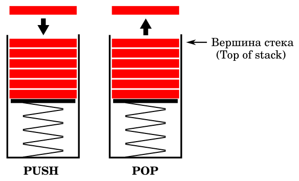
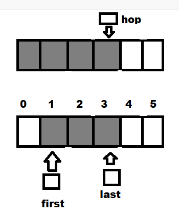
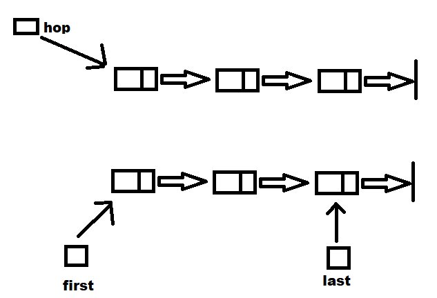

# Алгоритмы тренировка

## Задача: реализовать очередь и стек на массивах и на списках  
  
  

## Графическое представление решения задачи

## Пограничные случаи

### Стек на массивах:   
1. Стек пуст. Указатель ни на что не указывает
2. Стек переполнен. Добавлять элементы больше некуда.

### Очередь на массивах

1. Очередь пуста. Указатель на первый элемент никуда не указывает.
2. Очередь переполнена. Добавлять элементы некуда.

