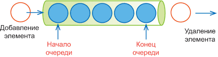
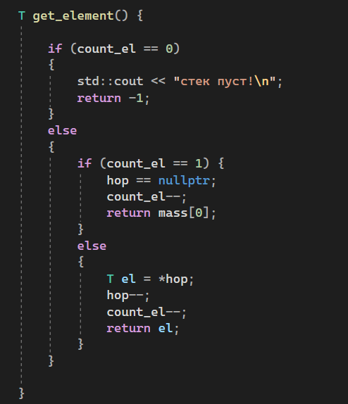

# Алгоритмы тренировка

## Задача: реализовать очередь и стек на массивах и на списках  
  
  

## Графическое представление решения задачи

## Пограничные случаи

### Стек на массивах:   
1. Стек пуст. Указатель ни на что не указывает
2. Стек переполнен. Добавлять элементы больше некуда.

### Очередь на массивах

1. Очередь пуста. Указатель на первый элемент никуда не указывает.
2. Очередь переполнена. Добавлять элементы некуда.

## Реализация на языке c++

| структура данных | функция добавления | функция извлечения |
|------------------|--------------------|--------------------|
| стек на массивах |||
| стек на списках |||
| очередь на массивах |||
| очередь на списках |||

## Заключение

### Таблица времени

|кол-во эл\структура|стек на массиве|стек на списках|очередь на массиве|очередь на списках|
|-------------------|---------------|---------------|------------------|------------------|
|1.000|||||
|10.000|||||

### Вывод:

По сравнению с масивами, списки выполняют свою работу быстрее.
